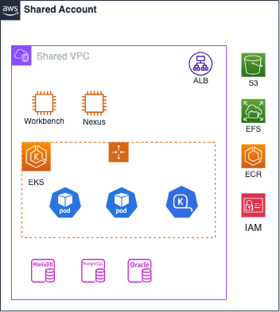

# Shared Account

Shared Account는 AWS Multi-Account 전략에서 전사적으로 공유되는 자원을 중앙에서 관리하기 위해 설계된 계정입니다. 이 계정은 조직 내 모든 워크로드 계정(Dev, Stg, Prd 등)이 공통으로 사용하는 리소스를 제공하고, 이를 효율적으로 관리하는 역할을 합니다. Shared Account를 사용하면 리소스 중복을 줄이고, 비용을 최적화하며, 중앙 집중식 관리로 운영 효율성을 높일 수 있습니다.

## Shared Account의 주요 역할

1. 공유 리소스 관리
   - 조직 전체에서 공통으로 사용하는 리소스를 중앙에서 관리합니다. 예를들어 Bitbucket, Nexus, 공유 솔루션 등이 해당됩니다.
2. 비용 최적화
   - 여러 계정이 동일한 리소스를 공유하므로 중복된 리소스 생성 비용을 줄이고, 효율적인 자원 사용이 가능합니다.
3. 운영 효율성
   - 공통 리소스를 한 곳에서 관리함으로써 운영 복잡성을 줄이고 일관성을 유지합니다.

## Infrastructure



## Variables

```
# Generic Variables
region      = "ap-northeast-2"
service     = "test"
environment = "dev"
owners      = "user.email.com"
accounts = {
  "mgmt"    = "096090541966"
  "network" = "096090541652"
  "shared"  = "096090541481"
  "sandbox" = "096090540647"
  "dev"     = "096090541979"
  "stg"     = "096090541898"
  "prd"     = "096090542079"
}
# KMS Variables
management_ebs_kms_key_arn = "arn:aws:kms:ap-northeast-2:096090541966:key/ed3c312a-6404-4ed7-9262-2bf90b921cf5"
management_rds_kms_key_arn = "arn:aws:kms:ap-northeast-2:096090541966:key/33f9c7b4-e207-44c0-ba46-f0b08234d9d6"

# Security Group Variables
create_security_group = true

# IAM Assumeable Role Variables
create_account_password_policy = true
account_alias                  = "test-shared"
create_iam_assumeable_role     = true

# ELB Variables
create_alb = true

# EKS Variables
create_eks_cluster                       = true
cluster_version                          = "1.31"
cluster_endpoint_public_access           = false
enable_cluster_creator_admin_permissions = true

# EFS app Variables
create_efs_app = true
efs_app_name   = "app"

# EC2 SMS/Notification Talk
create_ec2_sms          = false
ec2_sms_instance_type   = "m7g.large"
ec2_sms_ebs_volume_size = 100
ec2_sms_private_ip      = "10.13.214.162"

# EC2 NEXUS
# 해당 설정으로 구성 안함 (콘솔을 통한 mig 진행)
create_ec2_nexus          = false
ec2_nexus_instance_type   = "m7g.xlarge"
ec2_nexus_ebs_volume_size = 100
ec2_nexus_private_ip      = "10.13.214.133"

# EC2 WhaTap
create_ec2_whatap          = true
ec2_whatap_instance_type   = "c7g.2xlarge"
ec2_whatap_ebs_volume_size = 1000
ec2_whatap_private_ip      = "10.13.214.149"

# RDS Common Variables
create_db_subnet_group = true

# RDS MariaDB for solution Variables
create_mariadb                   = false
rds_mariadb_name                 = "mariadb-solution"
rds_mariadb_engine               = "mariadb"
rds_mariadb_engine_version       = "11.4.4"
rds_mariadb_instance_class       = "db.m7g.large"
rds_mariadb_family               = "mariadb11.4"
rds_mariadb_major_engine_version = "11.4.4"
rds_mariadb_allocated_storage    = 300
rds_mariadb_db_name              = "testm"
rds_mariadb_username             = "testdba"
rds_mariadb_port                 = 33064

# RDS Oracle for solution Variables
create_oracle                   = false
rds_oracle_name                 = "oracle-solution"
rds_oracle_engine               = "oracle-ee"
rds_oracle_engine_version       = "19"
rds_oracle_instance_class       = "db.r7i.xlarge"
rds_oracle_family               = "oracle-ee-19"
rds_oracle_major_engine_version = "19"
rds_oracle_allocated_storage    = 300
rds_oracle_db_name              = "testo"
rds_oracle_username             = "testdba"
rds_oracle_port                 = 15212

# RDS PostgreSQL for solution Variables
create_postgresql                   = false
rds_postgresql_name                 = "postgresql-solution"
rds_postgresql_engine               = "postgres"
rds_postgresql_engine_version       = "14.13"
rds_postgresql_instance_class       = "db.t4g.xlarge"
rds_postgresql_family               = "postgres14"
rds_postgresql_major_engine_version = "14"
rds_postgresql_allocated_storage    = 500
rds_postgresql_db_name              = "testp"
rds_postgresql_username             = "testdba"
rds_postgresql_port                 = 54321
```
